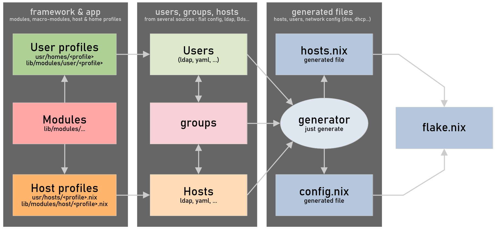

# Darkone NixOS Framework

Une configuration NixOS pensée pour devenir un framework pour la création et la gestion d'un réseau multi-host et multi-utilisateur avec NixOS.

> [!WARNING]  
> Projet en cours de développement.

Ce framework simplifie les choses grâce à&nbsp;:

- Une structure cohérente et modulaire.
- Des outils préconfigurés et fonctionnels.
- Une organisation pensée pour la scalabilité.

## Fonctionnalités

- **Déploiements multi-hosts** et multi-utilisateurs avec [colmena](https://github.com/zhaofengli/colmena) et [just](https://github.com/casey/just).
- **Profils de hosts** pour serveurs, conteneurs et machines de travail.
- **Profils de users** proposant des confs types pour de nombreux utilisateurs.
- **Modules complets** et 100% fonctionnels avec un simple `.enable = true`.
- **Architecture extensible**, cohérente, personnalisable.
- **Gestion des paramètres** utilisateur avec [home manager](https://github.com/nix-community/home-manager) + profils de homes.
- **[Homepage](https://github.com/gethomepage/homepage) automatique** en fonction des services activés.
- **Configuration transversale** pour assurer la cohérence du réseau.
- **Sécurisation facile et fiable**, un seul mdp pour déverouiller, avec [sops](https://github.com/Mic92/sops-nix).

## Organisation

A la racine :

- `lib` -> modules, users, hosts (framework)
- `usr` -> Projet local (en écriture)
- `var` -> Fichiers générés et logs
- `src` -> Fichiers source du générateur
- `doc` -> Documentation du projet

```
flake.nix  <-- Main flake
Justfile   <-- Project management
lib/       <-- Projet library
├── modules/
│   ├── default.nix       <-- Auto-generated default (by Justfile)
│   ├── system/           <-- System / Hardware configurations
│   │   ├── core.nix      <-- Core features (activated by default)
│   │   ├── i18n.nix      <-- Lang / Region settings
│   │   └── doc.nix       <-- Technical doc
│   ├── console/(...)     <-- CLI applications
│   ├── graphic/(...)     <-- X applications
│   ├── service/(...)     <-- Daemons
│   ├── admin/            <-- Nix administration settings
│   │   ├── nix.nix       <-- Nix tools
│   │   └── identity.nix  <-- Identities and grocomplet du réseau local
│   │   │   ├── backup.nix
│   │   │   ├── homelab.nix
│   │   │   └── builder.nix
│   │   ├── desktop/
│   │   │   ├── office.nix
│   │   │   └── administrator.nix
│   │   ├── container/
│   │   │   ├── docker.nix
│   │   │   └── nix.nix
│   │   └── vm/
│   │       ├── virtualbox.nix
│   │       └── xen.nix
│   └── user/          <-- User management (not home)
│       ├── nix.nix    <-- Nix special user
│       ├── build.nix  <-- Advanced user with development tools
├── homes/                <-- User profiles configuration (.nix) + home profiles (dirs)
│   ├── admin.nix         <-- Admin user profile configuration (extragroups, etc.)
│   ├── admin/(...)       <-- Admin user profile home
│   ├── developper(...)   <-- Advanced user with development tools
│   ├── minimal(...)      <-- Easy environment
│   ├── regular(...)      <-- Non-technical user
│   ├── gamer(...)        <-- Optimized environment for gamers
│   └── child(...)        <-- Kids softwares and settings
└── hosts/                <-- Hosts and host-templates declarations
    ├── desktop.nix       <-- A desktop host
    ├── laptop.nix        <-- A laptop host
    ├── server.nix        <-- A server host
    ├── minimal.nix       <-- A minimal host
    └── builder.nix       <-- Another host
usr/               <-- Writable zone for local network project
├── modules/(...)  <-- Local modules
├── secrets/(...)  <-- Local secrets file
├── homes/(...)    <-- Home profiles
├── machines/(...) <-- Machine specific configuration by hostname
├── hosts/(...)    <-- Host profiles
└── config.yaml    <-- Local configuration used by the generator
var/
├── log/
└── generated/    <-- Generated files
    └── hosts.nix <-- Hosts to deploy
src/(...)         <-- Generator sources
```

> [!NOTE]
> Pour le moment il est prévu que le framework soit cloné et que le projet de l'utilisateur soit situé dans `usr`, qui peut recevoir un projet git indépendant. Avoir une séparation entre le projet local et le framework (qui serait un simple input du flake local) est en cours d'étude.

## Le générateur

```shell
# Utilisation
just generate

# Génération + formattages + checks
just fix
```



Son rôle est de générer une configuration statique pure à partir d'une définition de machines (hosts), utilisateurs et groupes en provenance de diverses sources (déclarations statiques, ldap, etc. configurées dans `usr/config.toml`). La configuration nix générée est intégrée au dépôt afin d'être fixée et utilisée par le flake.

## Exemples

> [!CAUTION]
> Ces exemples ne sont pas encore fonctionnels. Ces configurations et commandes pourront différer dans la future version stable du projet.

Configurer un template de poste bureautique complet se fera très simplement :

```nix
# usr/hosts/desktop-office.nix
{
  # Activate all the necessary to have an office PC
  darkone.host.desktop.enable = true;

  # Activate the "office" theme with themed softwares
  darkone.theme.office.enable = true;

  # Add obsidian to the previous configuration
  darkone.graphic.obsidian.enable = true;
}
```

Puis on déclare des machines dans la configuration `usr/config.yaml` :

```yaml
hosts:
    static:
        - hostname: "my-pc"
          name: "A PC"
          profile: desktop-office
          users: [ "darkone" "john" ]
```

- Le profile `desktop-office` fait référence à `usr/hosts/desktop-office.nix`.
- Il existe aussi des profils de hosts pré-configurés dans `lib/hosts`.
- Les utilisateurs liés au host sont déclarés via `users` et/ou `groups`.
- Utilisateurs et groupes peuvent être déclarés dans la configuration ou dans LDAP.

> [!NOTE]
> Pour créer un poste, le plus simple est d'installer l'iso d'initialisation, même si ça fonctionne avec un poste contenant déjà un linux.
> 
> Création du poste et mises à jour (commandes simplifiées et optimisées) :
>
> ```sh
> # Création du host "pc01"
> just apply pc01 <ip-du-poste>
> 
> # Mise à jour
> just apply pc01
> 
> # Mise à jour de tous les "desktop"
> just apply @desktop
> ```
>
> On peut aussi utiliser des commandes régulières :
> 
> ```sh
> # Injection de la conf de patrick dans un poste physique
> # sur lequel a été installé l'iso du framework
> nixos-anywhere --flake '.#patrick' --target-host nix@<ip-du-poste>
> 
> # Mise à jour
> colmena apply --on patrick switch
> 
> # Mise à jour de tous les desktops
> colmena apply --on @desktop switch
> ```

### Créer une passerelle complète

Version minimale :

```nix
{
  # usr/hosts/server-gateway.nix
  darkone.host.gateway = {
    enable = true;
    wan.interface = "eth0";
    lan.interfaces = [ "eth1" "eth2" ];
  };
}
```

Version plus complète :

```nix
{
  # usr/hosts/server-gateway.nix
  darkone.host.gateway = {
    enable = true;
    wan = {
      interface = "eth0";
      gateway = "192.168.0.1"; # optional
    };
    lan = {
      interfaces = [ "wlan0" "enu1u4" ]; # wlan must be an AP
      bridgeIp = "192.168.1.1";
      domain = "arthur.lan"; # optional (default is <hostname>.lan)
      dhcp = { # optional
        enable = true;
        range = "192.168.1.100,192.168.1.230,24h";
        hosts = [
          "e8:ff:1e:d0:44:82,192.168.1.2,darkone,infinite"
          "f0:1f:af:13:62:a5,192.168.1.3,laptop,infinite"
        ];
        extraOptions = [
          "option:ntp-server,191.168.1.1"
        ];
      };
      accessPoints = [
        {
          wlan0 = {
            ssid = "Mon AP";
            passphrase = "Un password";
          };
        }
      ];
    };
  };
}
```

Déploiement (3 possibilités) :

```sh
# Simple and optimal
just apply gateway

# Colmena
colmena apply --on gateway switch

# Regular
nixos-rebuild switch --flake path:.#gateway --target-host admin@gateway --build-host gateway --fast --use-remote-sudo
```

## Justfile

```shell
❯ just
Available recipes:
    [_main]
    fix              # format (nixfmt) + generate + check (deadnix)
    install          # Framework installation (wip)

    [check]
    check            # Recursive deadnix on nix files
    flake-check      # Check the main flake

    [touch]
    format           # Recursive nixfmt on all nix files
    generate         # Update the nix generated files

    [utils]
    ssh-copy-id host # Copy local id on a new node (wip)
```

## Liste TODO

- [x] Architecture modulaire.
- [x] Configuration colmena.
- [ ] Déploiements avec Just (build regular + apply colmena).
- [x] Modules système de base (hardware, i18n, doc, network, performances).
- [x] Modules console de base (zsh, git, shell).
- [x] Modules graphic de base (gnome, jeux de paquetages).
- [x] Hosts préconfigurés : minimal, serveur, desktop, laptop.
- [x] [Justfile](https://github.com/casey/just) pour checker et fixer les sources.
- [ ] Création de noeuds avec [nixos-anywhere](https://github.com/nix-community/nixos-anywhere) + [disko](https://github.com/nix-community/disko) (wip).
- [ ] Homepage automatique en fonction des services activés (wip).
- [x] Configuration transversale générale (wip).
- [ ] Chaîne CI / CD pour la gestion de ce développement (wip).
- [ ] Passerelle type (dhcp, dns, ap, firewall, adguard, AD, VPN).
- [x] Postes types (bureautique, développeur, administrateur, enfant).
- [ ] Services pré-configurés pour serveurs (nextcloud, etc.).
- [ ] Gestion centralisée des utilisateurs avec [lldap](https://github.com/lldap/lldap).
- [x] Builder d'[ISOs d'installation](https://github.com/nix-community/nixos-generators) pour les machines à intégrer.
- [ ] Refactoring des commentaires de code en anglais.
- [ ] Documentation FR et EN (wip).
- [ ] Intégration de [nixvim](https://nix-community.github.io/nixvim/).
- [ ] Gestion du secure boot avec [lanzaboote](https://github.com/nix-community/lanzaboote).
- [x] Générateur de configuration nix statique (wip).
- [ ] Tests unitaires (wip).

## Idées en cours d'étude

> [!CAUTION]
> Pas encore fonctionnel.

### Installation K8S préconfigurée

Master (déclaration fonctionnelle sans autre configuration) :

```nix
{
  # Host k8s-master
  darkone.k8s.master = {
    enable = true;
    modules = {
      nextcloud.enable = true;
      forgejo.enable = true;
    };
  };
}
```

Slave (connu et autorisé par master car déclaré dans la même conf nix) :

```nix
{
  # Host k8s-slave-01
  darkone.k8s.slave = {
    enable = true;
    master.hostname = "k8s-master";
  };
}
```

Master avec options :

```nix
{
  # Host k8s-master
  darkone.k8s.master = {
    enable = true;
    modules = {
      nextcloud.enable = true;
      forgejo.enable = true;
    };
    preemtibleSlaves = {
      hosts = [ "k8s-node-01" "k8s-node-02" ];
      xen.hypervisors = [
        {
          dom0 = "xenserver-01";
          vmTemplate = "k8s-node";
          minStatic = 3;
          maxPreemptible = 20;
        }
      ];
    };
  };
}
```
